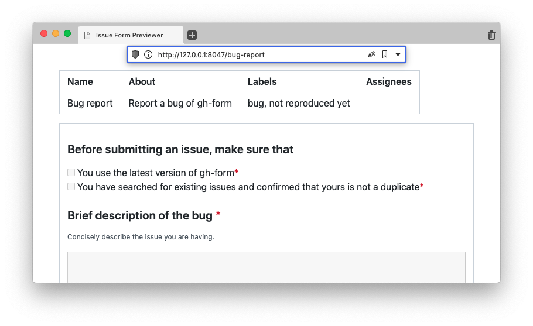

# gh-form

[](https://github.com/yudai-nkt/gh-form/releases)
[](https://crates.io/crates/gh-form)

Don't let malformed issue forms pushed to GitHub

## Overview

gh-form allows you to locally preview [YAML-formatted issue forms](https://docs.github.com/en/communities/using-templates-to-encourage-useful-issues-and-pull-requests/syntax-for-issue-forms) as HTML.



## Installation

There are several ways to install gh-form depending on which toolchain you are using.

### GitHub CLI users

gh-form is available as a GitHub CLI extension:

```console
gh extension install yudai-nkt/gh-form
```

### Rustaceans

gh-form is also available on crates.io:

```console
cargo install gh-form
```

### Others

Download a binary from GitHub Releases and put it in your PATH.

## Synopsis

```console
USAGE:
    gh-form <SUBCOMMAND>

OPTIONS:
    -h, --help       Print help information
    -V, --version    Print version information

SUBCOMMANDS:
    help       Print this message or the help of the given subcommand(s)
    preview    Start a local server to preview issue form
```

## License

This repository is licensed under the MIT License.
See [LICENSE.md]() for details.
